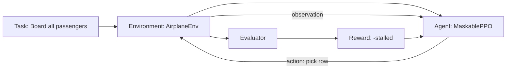
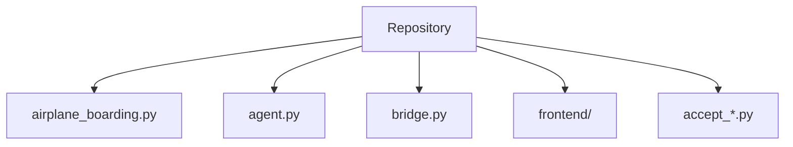

# RLE Airplane Boarding
> A verifiable Reinforcement Learning Environment for agent training and evaluation.

<div align="center">


</div>

---

## Overview

A Reinforcement Learning Environment (RLE) provides a formalized closed-loop framework for agent training and evaluation: defining the task, streaming structured state observations, validating available actions, computing programmatic rewards, and evaluating success via deterministic verification suites.

RLE Airplane Boarding models passenger ingress dynamics inside a commercial aircraft cabin. At each decision step, the agent chooses which row of passengers in the lobby queue to admit into the boarding lane. The operational objective is to minimize cumulative aisle interference and passenger stalling until all seats are occupied.

Frontier AI labs increasingly rely on deterministic, verifiable environments to train and benchmark autonomous reasoning and decision-making agents. This repository provides a clean, modular reference template demonstrating standard Gymnasium compliance, invalid action masking, programmatic verification, and an interactive real-time inspection dashboard.

---

## Demo

<div align="center">

[](https://youtu.be/h2OHzJ6nSmI)

Caption: "Random policy (-169) vs Trained policy (-151) on a 10×5 cabin."

</div>

---

## Architecture

The environment architecture separates agent decision-making, physical state transitions, and programmatic evaluation into independent, verifiable modules.

### ASCII Diagram

```text
    ┌────────────┐   action   ┌──────────────┐
    │   Agent    │ ─────────► │ Environment  │
    │ (Maskable  │            │ (AirplaneEnv)│
    │    PPO)    │ ◄───────── │              │
    └────────────┘ observation└──────┬───────┘
                                     ▼
                              ┌──────────────┐
                              │  Evaluator   │
                              └──────────────┘
```

### Mermaid Diagram: RLE Loop



### Mermaid Diagram: Repository Layout



---

## The RLE Loop

1. Task is defined
2. Agent observes state
3. Agent picks an action
4. Environment updates
5. Reward is computed programmatically
6. Episode terminates when verified
7. Repeat

---

## Environment Spec

| Property | Value |
|---|---|
| Env ID | `airplane-boarding-v0` |
| Action space | `Discrete(num_of_rows)` |
| Observation | `Box(2 × num_of_seats)` — (seat_num, status) pairs |
| Reward | `-num_passengers_stalled` per step |
| Terminal | lobby empty AND boarding line empty |
| Render modes | `human`, `terminal` |
| Framework | Gymnasium 1.0 |
| Training | MaskablePPO (sb3-contrib) |

---

## Verification Results

### Formal Verification (5×5 Cabin)

| Check | Result |
|---|---|
| Task is well-defined | ✅ PASS |
| State changes on action | ✅ PASS |
| Action space is meaningful | ✅ PASS |
| Reward is deterministic | ✅ PASS |
| Terminal condition correct | ✅ PASS |
| Trained beats Random | ✅ PASS (+4.20) |

#### Environment Acceptance Output (`accept_rle.py`)

```text
============================================================
RUNNING ACCEPTANCE TEST: accept_rle.py
============================================================

--- CHECK 1: TASK is well-defined ---
Total plane seats: 25
Initial state: Lobby passengers=25, Aisle line passengers=0, Seated=0
Task Objective: Board all 25 passengers from lobby to plane seats while minimizing aisle stalling.
Final state: Seated=25/25, Lobby=0, Aisle=0
CHECK 1 RESULT: PASS

--- CHECK 2: STATE changes on action ---
Snapshot initial obs (first 10 values): [-1 -1 -1 -1 -1 -1 -1 -1 -1 -1]
  Step 1: Action=0, Reward=0
  Step 2: Action=0, Reward=0
  Step 3: Action=0, Reward=0
Snapshot after 3 steps (first 10 values): [-1 -1 -1 -1  4  0  3  0  2  0]
Obs indices changed: [4, 5, 6, 7, 8, 9]
Differences (initial vs after 3 steps):
  Index 4: -1 -> 4
  Index 5: -1 -> 0
  Index 6: -1 -> 3
  Index 7: -1 -> 0
  Index 8: -1 -> 2
  Index 9: -1 -> 0
CHECK 2 RESULT: PASS

--- CHECK 3: ACTION space is meaningful ---
Action space confirmed: Discrete(5)
Initial action masks: [True, True, True, True, True]
Action masks after exhausting row 2: [True, True, False, True, True]
CHECK 3 RESULT: PASS

--- CHECK 4: REWARD is programmatic and consistent ---
5 Masked-random episode rewards (Run 1): [-80.0, -65.0, -71.0, -81.0, -70.0]
5 Masked-random episode rewards (Run 2): [-80.0, -65.0, -71.0, -81.0, -70.0]
Reward stats over 5 episodes: Min=-81.0, Mean=-73.40, Max=-65.0
CHECK 4 RESULT: PASS

--- CHECK 5: TERMINAL condition works ---
Episode completed in 25 steps.
At terminal state: Lobby count=0, Boarding line count=0
Final total reward: -150.0
CHECK 5 RESULT: PASS

============================================================
ACCEPT_RLE SUMMARY:
  CHECK 1 (TASK is well-defined): PASS
  CHECK 2 (STATE changes on action): PASS
  CHECK 3 (ACTION space is meaningful): PASS
  CHECK 4 (REWARD is programmatic and consistent): PASS
  CHECK 5 (TERMINAL condition works): PASS
============================================================
```

#### Learning Acceptance Output (`accept_learn.py`)

```text
============================================================
RUNNING ACCEPTANCE TEST: accept_learn.py
============================================================
Config: num_of_rows=5, seats_per_row=5
Training MaskablePPO for 20000 timesteps...
Training completed in 37.78s.

Evaluating Random (Masked) Policy over 10 episodes...
Random episode rewards: [-81.0, -45.0, -84.0, -69.0, -70.0, -59.0, -93.0, -59.0, -47.0, -75.0]
Random Policy Mean Reward: -68.20

Evaluating Trained Policy over 10 deterministic episodes...
Trained episode rewards: [-64.0, -64.0, -64.0, -64.0, -64.0, -64.0, -64.0, -64.0, -64.0, -64.0]
Trained Policy Mean Reward: -64.00

============================================================
COMPARISON & VERDICT:
Random Mean Reward : -68.20
Trained Mean Reward: -64.00
Difference (Trained - Random): +4.20
Result: PASS (Agent learned! Improvement of +4.20 points)
============================================================
```

### Visual Verification (10×5 Cabin, Live Dashboard)

| Policy | Mean Reward |
|---|---|
| Random | -169 |
| Trained | -151 |
| Delta | **+18** |

---

## Stack

### Environment & Training
- Python 3.11
- Gymnasium 1.0
- Stable-Baselines3 + sb3-contrib (MaskablePPO)
- NumPy
- PyTorch (CPU)

### Visualization
- Next.js 16 (App Router)
- React 19
- TypeScript
- Tailwind CSS
- Framer Motion
- Recharts

---

## Quickstart

### 1. Run the Environment

```bash
# Create and activate virtual environment
python -m venv .venv
.venv\Scripts\activate      # Windows
source .venv/bin/activate   # macOS/Linux

# Install dependencies
pip install -r requirements.txt

# Run Gymnasium environment checker & RLE acceptance
python -m tests.check_env
python -m tests.accept_rle
```

### 2. Train a Policy

```bash
# Quick learning acceptance verification (20k steps)
python -m tests.accept_learn

# Full production training run
python -m training.agent
```

### 3. Run the Dashboard

```bash
# Start backend API (Terminal 1)
python -m src.server.server

# Start Next.js frontend (Terminal 2)
cd frontend
npm install
npm run dev
# open http://localhost:3000
```

---

## Repository Layout

```text
.
├── src/                          # Core Python package
│   ├── env/
│   │   └── airplane_boarding.py  # Pure Gymnasium environment implementation
│   ├── core/
│   │   └── rle_core.py           # Headless RLE session and evaluation logic
│   └── server/
│       ├── bridge.py             # Subprocess bridge and state serializer
│       └── server.py             # FastAPI backend API server
├── training/                     # RL training pipelines
│   ├── agent.py                  # MaskablePPO training and evaluation
│   ├── train_10x5.py             # 10x5 cabin policy trainer
│   └── train_frontend_10x5.py    # Training pipeline with live metrics
├── tests/                        # Automated verification test suites
│   ├── check_env.py              # Gymnasium API compliance checker
│   ├── smoke_test.py             # Training smoke test
│   ├── eval_smoke.py             # Checkpoint evaluator
│   ├── accept_rle.py             # 5-stage formal RLE specification suite
│   ├── accept_learn.py           # Policy convergence verification test
│   ├── qa_audit.py               # Stress test & observation bounds audit
│   ├── qa_reward_audit.py        # Step-by-step reward trace audit
│   └── test_bridge.py            # IPC bridge integration test
├── docs/                         # System architecture & verification reports
│   ├── architecture.md           # Architecture design & extension notes
│   └── results.md                # Benchmark & test verification runs
├── frontend/                     # Next.js real-time visual boarding dashboard
├── pyproject.toml                # Project metadata and package configuration
├── requirements.txt              # Python dependency specifications
├── render.yaml                   # Cloud deployment configuration
└── LICENSE                       # Apache 2.0 License
```

---

## Design Decisions

- **Why MaskablePPO**: Rows with no remaining passengers in the lobby are invalid actions. Invalid action masking prevents the policy from selecting empty rows without distorting the policy gradient through arbitrary negative penalties.
- **Why Reward is Negative-Only**: A step reward of `-num_passengers_stalled` penalizes congestion while avoiding artificial reward inflation from episode length or step-count offsets.
- **Why 10×5 Board**: A 10-row, 5-seat cabin configuration mirrors realistic single-aisle commercial aircraft layouts and provides an optimal state-space size for rapid experimentation.
- **Why Dashboard is Separate**: The Gymnasium environment is designed as a standalone headless RL product; the frontend dashboard acts strictly as an observational inspection viewer decoupled via REST and subprocess interfaces.

---

## Limitations & Roadmap

### Current Limitations
- Trained on a fixed 10×5 configuration
- Reward is dense but not shaped
- No Docker image yet

### Roadmap
- [ ] Multi-agent boarding
- [ ] Luggage capacity constraints
- [ ] Comparison against brute-force optimal
- [ ] Docker Compose for one-command reproduction
- [ ] Hosted playground

---

## License

This project is licensed under the Apache 2.0 License.

---

## Acknowledgements

- **Gymnasium**: Standard API for reinforcement learning environments.
- **Stable-Baselines3 & sb3-contrib**: Reliable implementations of MaskablePPO.
- **Hugging Face Repo2RLEnv**: Conceptual inspiration for structuring verifiable RL repositories.
- **Telegraph Lab**: Motivation and problem framing.
